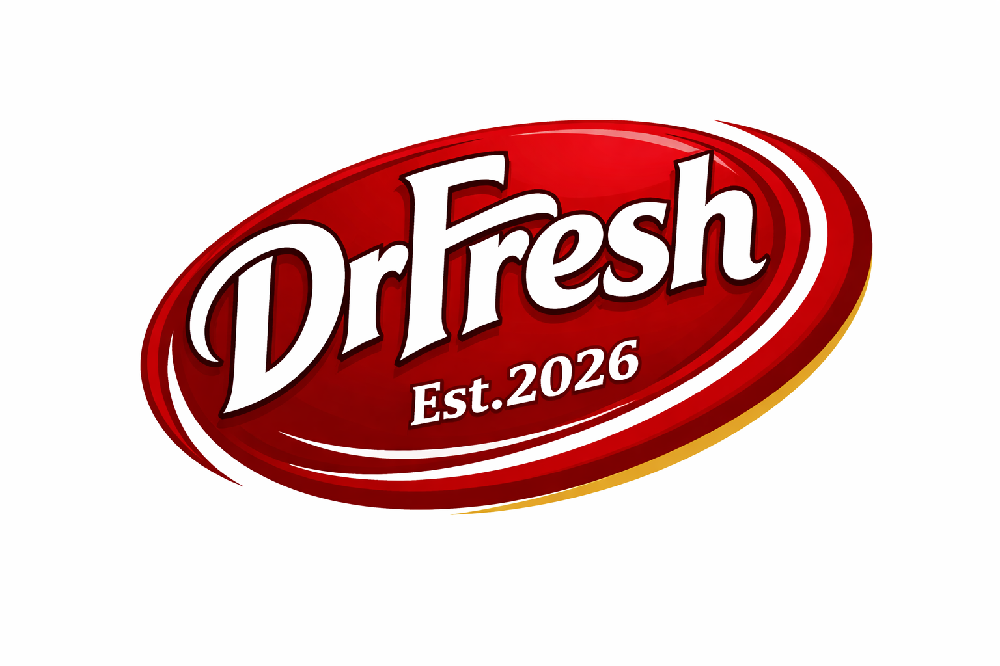

  
  

# ECE490 Team Project Repository

## Team Information

Team name: `DrFresh`

Team members:

- Ούζας Βασίλειος

- Αλίνο Παπαγιάννης

## Project Title
Smart Drinks Dispenser

### Project Summary

This project focuses on the design and implementation of a smart drinks
dispenser with two liquid tanks, automated serving, refill monitoring, and a
user-facing GUI. The goal is to demonstrate how sensing, actuation, local decision
logic and cloud-connected notifications can be integrated into a complete IoT
system.

## Objectives

- Design an IoT cyber-physical system with sensing and actuation
- Implement control logic for serving and blocking behavior
- Estimate liquid usage and tank state over time
- Develop event-driven alerts and notifications
- Build a GUI for command triggering and status visualization
- Apply reliability and fallback behavior in a real dispensing system

## Repository Structure
- `src/` → source code
- `docs/` → architecture, setup, extra documentation
- `data/` → datasets, logs, exported measurements
- `tests/` → tests
- `progress.md` → weekly progress log
- `milestones.md` → milestone evidence map
- `demo-evidence/` → screenshots, output snapshots, demo proof

## Required Workflow
1. Create an Issue before starting a task
2. Work in a branch
3. Commit regularly with meaningful messages
4. Open a Pull Request
5. Merge into `main`
6. Update `progress.md`

## Deliverables to maintain
- complete `README.md`
- weekly `progress.md`
- `docs/architecture.md`
- `milestones.md`
- demo evidence in `demo-evidence/`

## Current Status
The project is officially finished and ready for demonstration at the class 

